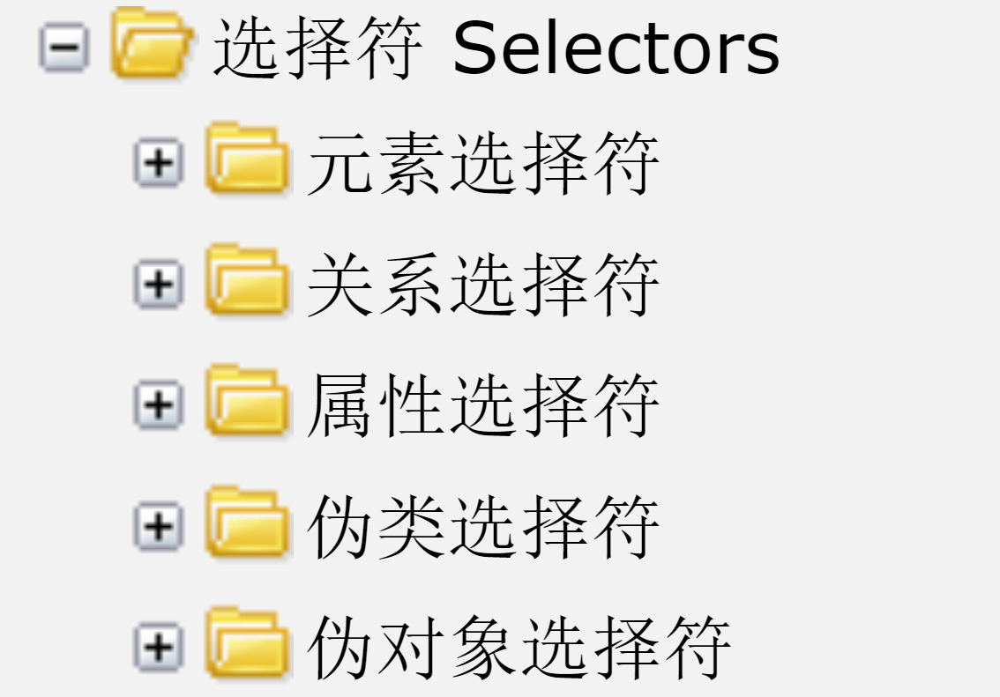

[TOC]
### 第二周第三天笔记
####1.CSS的语法
> 选择器  { 属性名: 属性值;  属性名: 属性值; }

#### 2.选择器梳理
> `面试题1: css选择器有哪些，css3新增伪类有哪些？`
> `面试题2: 请列举你所知道的css3中新增的选择器?`

> **元素选择器**
> - 通配符选择器 , 符号`*`,一般用来去掉浏览器默认自带的间距 `*{margin:0;padding:0}`,权重：0 - 1 
> - 标签选择器: 直接通过标签名称获取元素,权重：1 `a{color:red}`  
> - 类选择器/class 选择器： 符号 `.`,权重：10  `.box{color:red}`
> - id选择器： 符号 `#` ,权重：100  

> **关系选择器**
> - 后代(包含)选择器:  `ul  li  a{}`,权重： 每一个元素选择器权重之合；
> - 子代选择器: `ul>li>a{}`,权重： 每一个元素选择器权重之合；
> - 相邻选择器:  `h1 + h2`,h1的相邻的兄弟元素h2起作用，加号前面的元素只是参照物；加号后面的元素才会起作用；

> **伪类选择器**
> - a: link 、 a: visited、a:hover、 a:active 四种状态
> - :not(s)  排除掉S这个选择器
> - :nth-child(n) 选择第几个子元素
> - :first-child 选择第一个子元素
> - :last-child选择器最后一个子元素

> **伪元素选择器**
> - :first-letter 选择第一个字
> - :first-line 选择第一个行
> - :before  在元素的内容前面添加一个子元素
> - :after 在元素的内容后面添加一个子元素

